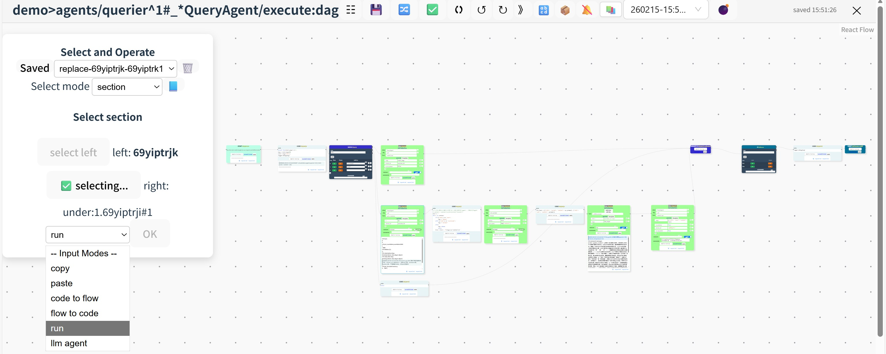
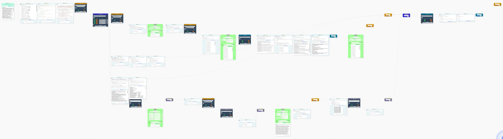

### Example snapshots



[English](#english) | [中文](#中文说明)
##  GraPy: A Visual, Nestable, and Interactive Python Programming Platform
GraPy is the first visual programming environment that enables **interactive execution inside deeply nested Python structures**—including functions, loops, and conditionals—while maintaining local state and full language expressiveness.
## Key Features
- **Flow-based UI powered by ReactFlow**: Drag-and-drop task orchestration with seamless integration of hierarchical interactive programming and Python.
- **Full Python coverage**: 8 control-flow nodes, 7 functional nodes (including raw Python code), and 2 tool nodes (class and function) support virtually all Python capabilities.
- **Bidirectional graph ↔ code conversion**: Your Python code *is* the DSL—edit visually or textually.
- **Deep nesting support**: Flow structure can be nested up to ~50 levels (limited only by indexing length), enabling complex workflows with local interactivity even inside branches or custom functions.
- **Hierarchical variable scoping**: The executor preserves and exposes state from any scope—even those inside user-defined functions—after execution.
- **Automatic variable tracking**: Every node introspects and displays its inputs, outputs, and local variables for instant debugging.
- **Enhanced productivity**: Built-in tool-call nodes, auto-completion features, and one-click auto-layout improve visual clarity and programming speed.
- **Extensible connectivity**: Call other GraPy modules, import local Python scripts (configurable paths), reuse existing virtual environments, and read/write local files. Each module acts as a hub for local and network resources.
- **Flexible workflow manipulation**: 4 selection modes let you run, convert to code, copy, or AI-edit partial or full flows.
- **Built-in AI agent**: Interactively generate and optimize workflows using an integrated LLM-powered assistant.
## Use Cases
- Develop any Python application with real-time debugging and iterative refinement.
- Build, debug, and demo AI/ML pipelines, data processing workflows, automation scripts, and other tasks requiring high interactivity and visualization.
- Debug existing local Python code by wrapping it in GraPy nodes.
- Visualize legacy code by converting it into interactive flow graphs.
- Teach and learn Python with immediate feedback and structural clarity.
- Discover your own creative workflows!
## Deployment
GraPy is designed for **local deployment**.  
✅ **Supported**: Linux (including WSL2 on Windows)  
🚧 **Windows native support**: Coming soon
### Recommended Setup
- Use **Docker Compose** to run the frontend, Redis, and MySQL services.
- Run the **application server** (`server/`) and **sandbox executor** (`sandbox/`) directly in your local Python environment.
This hybrid approach gives you:
- Full access to local files and existing Python environments
- Easy dependency isolation via Docker for infrastructure services
> We will illustrate the deploying process with Ubuntu 20.04 on WSL2, Docker, and Miniconda3.
### Quick Start
**Clone the repository**
```bash
git clone git@github.com:zrchn/GraPy.git
cd GraPy
```
**Set up Python environment** (Python 3.10–3.12 supported)
Skip if you already have a compatible environment.
```bash
conda create -n grapy python=3.11
conda activate grapy
```
**Install dependencies** (for both server and sandbox)
```bash
pip install -r requirements.txt
```
**Start Docker services** (frontend, MySQL, Redis)
First time or after updates:
```bash
docker-compose up --build
```
Subsequent starts:
```bash
docker-compose up
```
**Launch the backend server** (in a new terminal)
```bash
cd server
conda activate grapy
python serve.py
```
**Launch the sandbox executor** (in another new terminal)
```bash
cd sandbox
conda activate grapy
python sandbox_serve.py
```
**Open in browser** Visit http://localhost:8808
### Updating
To update to the latest version:
```bash
git pull
docker-compose down
docker-compose up --build
```
Then restart the server and sandbox processes as above.
## 中文说明
## GraPy: 世界首个Python图像化可嵌套交互式编程平台。
### 创新功能
- 使用ReactFlow流程图UI，首次实现任务流拖拽编排、深度分层交互式编程与Python的无缝整合；
- 提供8种控制流节点、7种功能节点（含纯Python代码节点）和2种工具节点（类和函数），可完整实现Python的几乎所有能力；
- 流程图可与python代码无缝互转，python即DSL；
- 工具、控制流节点理论上可无限嵌套（受制于索引长度，实际可嵌套约50层，绝大多数场景远超所需），且能在控制流分支和工具内部实现局部交互编程；
- 配合使用分层变量管理技术的执行器，即使位于函数内部的节点状态也可以在运行后被维持和使用；
- 每个节点自动搜查和维护变量与输出，debug时所有状态一目了然；
- 内置工具调用节点和多种自动补全机制以提高可视化程度和编程效率，并提供一键自动布局功能；
- 超强的拓展能力，能够调用其他GraPy模块、宿主机代码（可配置路径）、环境模块（可直接使用已有环境），也能增删查改本地文件，每个GraPy模块都是可调用本地和网络资源的枢纽；
- 极佳的操控灵活性，4种选区模式选中局部或完整任务流运行、转代码、复制粘贴、AI修改等；
- 内置交互式AI智能体可自动生成和优化任务流。
### 使用场景
- 开发任何可使用Python的应用，特别是希望边开发边调试的场景；
- 对交互编程和可视化要求较高的AI、机器学习、数据处理、自动化查询等流程的搭建、调试与演示；
- 连接本地代码，对本地代码进行调试；
- 使用代码转任务流能力对代码进行可视化；
- 初学Python入门和教学；
- 更多应用场景等你发现！
### 部署
本应用为本地部署。目前支持Linux系统（Windows用户可使用WSL2），纯Windows版本正在开发中。我们推荐的部署方案：
- 使用Docker compose部署前端、Redis服务、MySQL服务；
- 使用本地环境直接运行应用端（server路径）和执行器（sandbox路径）。
好处：在支持无缝访问本地文件、调用本地代码、并允许复用已有环境的前提下，用Docker做最大程度的简化。
**请先确保你有Linux系统**，并克隆本仓库。本示例将使用WSL2 Ububtu 20.04、Docker、miniconda3。
```bash
git clone git@github.com:zrchn/GraPy.git
```
**创建环境**。本应用支持Python 3.10~3.12版本。如果你已有现成的Python 3.10/3.11/3.12 环境，可以复用现有环境、跳过创建。此处命令仅在首次部署或切换到新环境时需要运行。
```bash
conda create -n grapy python=3.11
conda activate grapy
```
**安装依赖**。后端服务和沙盒服务将使用同一个环境。此处命令在首次部署、切换到新环境、基于现有环境安装GraPy时运行。
```bash
pip install -r requirements.txt
```
**Docker-compose启动前端、MySQL、Redis**
更新或首次部署:
```bash
docker-compose up --build 
```
后续每次启动：
```bash
docker-compose up
```
#### 启动后端服务层
新建一个命令窗口，执行：
```bash
cd server
conda activate grapy
python serve.py
```
#### 启动沙盒
再新建一个命令窗口，执行：
```bash
cd sandbox
conda activate grapy
python sandbox_serve.py
```
至此所有服务都已启动。打开浏览器，输入http://localhost:8808 打开页面。
### 更新
包括同步代码、以及重容器。
```bash
git pull
docker-compose down
docker-compose up --build
```
并使用上述提到的指令启动服务层和沙盒。